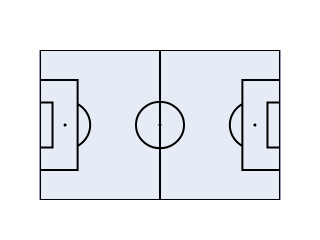
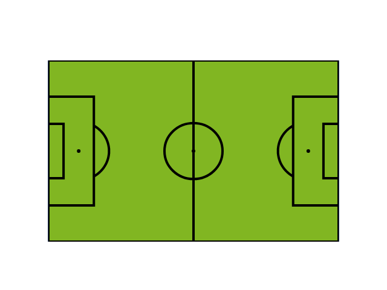
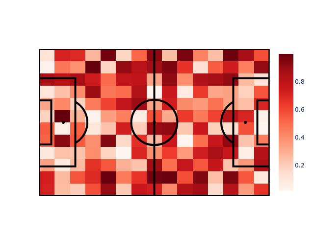

# plotly-football-pitch


This repo contains code to plot football pitches using `plotly`. Currently only horizontal pitches are supported, with the origin located at the bottom left
corner of the pitch.

## Examples

Further examples can be found in `examples/pitch.ipynb`.

```python
from plotly_football_pitch import make_pitch_figure, PitchDimensions


dimensions = PitchDimensions()
fig = make_pitch_figure(dimensions)
fig.show()
```



```python
from plotly_football_pitch import (
    make_pitch_figure,
    PitchDimensions,
    SingleColourBackground
)


dimensions = PitchDimensions()
fig = make_pitch_figure(
    dimensions,
    pitch_background=SingleColourBackground("#81B622"),
)
fig.show()
```



```python
import numpy as np

from plotly_football_pitch import make_pitch_figure, PitchDimensions


dimensions = PitchDimensions()
fig = make_pitch_figure(dimensions)

# define number of grid squares for heatmap data
width_grid = 12
length_grid = 15

data = np.array([
    [random.random() for _ in range(length_grid)]
    for _ in range(width_grid)
])

fig = add_heatmap(fig, data)
fig.show()
```



## Installation

`pip install plotly_football_pitch`

## Development installation

```bash
make setup-env
source .venv/bin/activate
make dev-install
```
